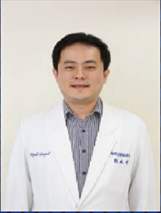
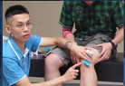
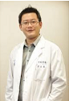
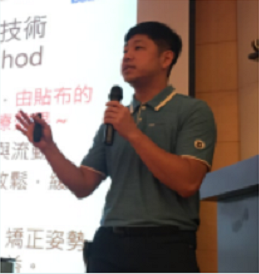
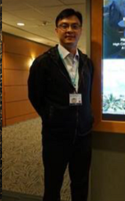
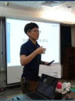
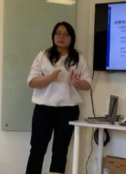
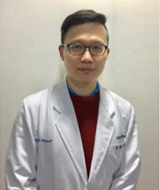
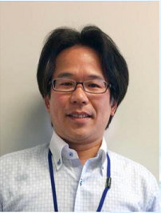

## 刘毓修

* 台湾大学物理治疗学系暨研究所硕士
* 台北永诚康复中心行政主任
* 蓝海曙光集团运动暨物理治疗召集人
* 蓝海曙光集团副技术长，肌能系贴扎国际讲师（CKTI）
* SMART自我肌筋膜放松技巧课程讲师
* 台北健康护理大学运动保健系讲师

## 李建志

* 台湾杏诚康复中心学术主任
* 台湾肌能系贴扎学会理事
* 台北市物理治疗师公会理事
* 台北市健康新生活协会监事
* 肌能系贴扎国际讲师（CKTI）
* 台大医院脑中风中心物理治疗师
* 台湾大学物理治疗研究所硕士

## 宗志豪

* 台北杏诚康复中心主任
* 2017年台北世界大学生运动会运动防护团队执行长
* 台湾物理治疗师公会理事
* 台北物理治疗师公会运动物理治疗委员会主委
* 台湾肌能系贴扎学会常务理事
* 台湾应用康复协会理事
* 肌能系贴扎国际讲师（CKTI）
* SMART自我肌筋膜放松技巧课程讲师
* 台湾健美协会教练训练课程讲师

## 翁舜颐

* 台湾宏恩综合医院语言中心主任
* 台湾应用康复协会理事长
* 台湾听力语言学会监事
* 台北市语言治疗师公会理事
* 台湾语言治疗师公会常务监事
* 肌能系贴扎国际讲师（CKTI）

## 胡家诚

* 台湾宏恩综合医院康复科技术主任
* 台北市物理治疗师公会监事
* 台湾应用康复协会监事
* 肌能系贴扎国际讲师（CKTI）
* SMART自我肌筋膜放松技巧课程讲师
* 台湾健美协会教练训练课程讲师

## 陈虹频

* 台湾宏恩综合医院运动医学主任
* 蓝海曙光集团品牌总监
* 台湾成功大学物理治疗系学士
* 肌能系贴扎国际讲师（CKTI）
* 下肢生物力学与足踝矫正课程国际讲师

## 李芝莹

* 台北永诚康复中心言语治疗主任
* 台北护理健康大学听语障碍科学研究所硕士
* 中山医学大学言语治疗与听力学系学士
* 台北市巡回语言治疗师
* 台湾肌能系贴扎学会理事
* 肌能系贴扎国际讲师（CKTI）

## 许颖昌

* 台湾宏恩综合医院物理治疗主任
* 台湾大学物理治疗学系学士
* 台北市物理治疗师公会理事
* 台北市健康新生活协会理事
* SMART自我肌筋膜放松技巧课程讲师
* 肌能系贴扎国际讲师（CKTI）

## 村上仁之

* 日本姬路独协大学医疗保健系副教授
* 认知神经康复学会理事评议员
* 日本兵库县认知神经康复研究会会长
* 国际康复治疗技术学会CTE中国研究学会名誉会长